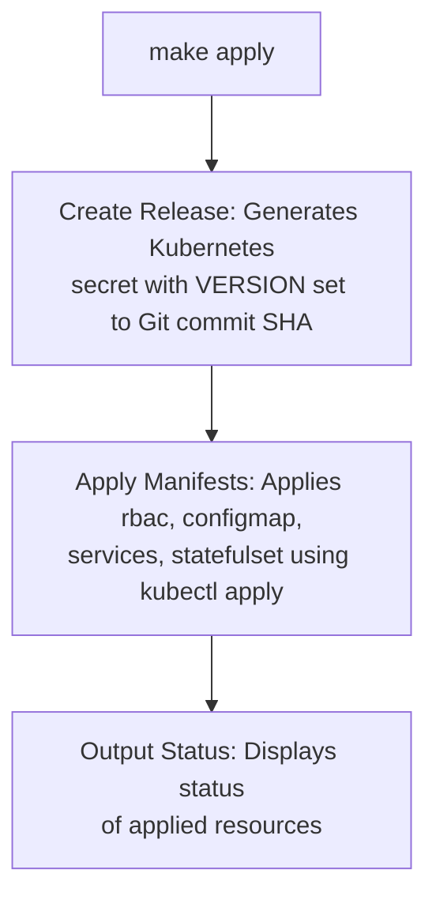

-
[](https://radikal.host/i/IrPiQD)
## Table of Contents

- [Preface](#preface)
- [How It Works](#how-it-works)
- [Comparasing](#debugging-and-transparency)
- [Helm](#Helm)
- [Kustomize Critique](#kustomize-critique)
- [Alternative Approaches](#alternative-approaches)
- [KISS Principles](#kiss-principles)
- [Constraints](#constraints)
- [Labels](#Labels)
- [Diff Utilities](#diff-utilities)
- [Helm Chart Generation](#helm-chart-generation)
- [Conclusion](#conclusion)

## Preface

Modern Kubernetes deployment methodologies have grown increasingly complex, layering abstraction upon abstraction in pursuit of flexibility. This article challenges that trajectory by examining how fundamental Unix tools combined with Makefiles can provide a more transparent and maintainable alternative to popular solutions like Helm and Kustomize.

What you'll find here is a way to deploy applications where you can always see the actual YAML being applied to your cluster, where debugging means looking at real configuration rather than guessing what a template might generate, and where changes follow predictable paths rather than disappearing into abstraction layers.

If you've ever spent an afternoon chasing a Helm templating error only to discover it was caused by a misplaced whitespace, or wasted hours debugging why your Kustomize overlay isn't applying correctly, you'll understand why we need simpler approaches to Kubernetes deployments. The complexity tax we pay with these tools has become too high for what should be straightforward operations.

What follows is not a prescriptive framework, but rather an examination of core patterns that can be adapted to various deployment scenarios. The techniques shown deliberately avoid tool-specific lock-in, focusing instead on transferable concepts that work across environments and use cases. Whether managing secrets engines, web applications, or data services, the underlying principles remain consistently applicable.

This is about getting back to basics - not because simple is trendy, but because simple works. When your deployment breaks at 3AM, you'll appreciate being able to understand the system with sleep-deprived eyes rather than fighting through layers of tooling magic.

---

[](https://radikal.host/i/IrPLdQ)
## Helm

Helm was designed to simplify Kubernetes application deployment, but it has become another abstraction layer that introduces unnecessary complexity. Helm charts often hide the underlying process with layers of Go templating and nested `values.yaml` files, making it difficult to understand what is actually being deployed. Debugging often requires navigating through these files, which can obscure the true configuration. This approach shifts from infrastructure-as-code to something less transparent, making it harder to manage and troubleshoot.

```yaml
  imagePullPolicy: {{ .Values.defaultBackend.image.pullPolicy }}
{{- if .Values.defaultBackend.extraArgs }}
  args:
  {{- range $key, $value := .Values.defaultBackend.extraArgs }}
    {{- /* Accept keys without values or with false as value */}}
    {{- if eq ($value | quote | len) 2 }}
    - --{{ $key }}
    {{- else }}
    - --{{ $key }}={{ $value }}
    {{- end }}
  {{- end }}
{{- end }}
```

YAML itself isn’t inherently problematic, and with modern IDE support, schema validation, and linting tools, it can be a clear and effective configuration format. The issues arise when YAML is combined with Go templating, as seen in Helm. While each component is reasonable on its own, their combination creates complexity. Go templates in YAML introduce fragile constructs, where whitespace sensitivity and imperative logic make configurations difficult to read, maintain, and test. This blending of logic and data undermines transparency and predictability, which are crucial in infrastructure management.

Helm's dependency management also adds unnecessary complexity. Dependencies are fetched into a `charts/` directory, but version pinning and overrides often become brittle. Instead of clean component reuse, Helm encourages nested charts with their own `values.yaml`, which complicates customization and requires understanding multiple charts to override a single value. In practice, Helm’s dependency management can feel like nesting shell scripts inside other shell scripts.

## Kustomzie

[Kustomize](https://github.com/kubernetes-sigs/kustomize) offers a declarative approach to managing Kubernetes configurations, but its structure often blurs the line between declarative and imperative. Kustomize applies transformations to a base set of Kubernetes manifests, where users define overlays and patches that _appear_ declarative, but are actually order-dependent and procedural.

It supports various patching mechanisms, which require a deep understanding of Kubernetes objects and can lead to verbose, hard-to-maintain configurations. Features like generators pulling values from files or environment variables introduce dynamic behavior, further complicating the system. When built-in functionality falls short, users can use KRM (Kubernetes Resource Model) functions for transformations, but these are still defined in structured data, leading to a complex layering of data-as-code that lacks clarity.

While Kustomize avoids explicit templating, it introduces a level of orchestration that can be just as opaque and requires extensive knowledge to ensure predictable results.

---

In many Kubernetes environments, the configuration pipeline has become a complex chain of tools and abstractions. What the Kubernetes API receives — plain YAML or JSON — is often the result of multiple intermediate stages, such as Helm charts, Helmsman, or GitOps systems like Flux or Argo CD. As these layers accumulate, they can obscure the final output, preventing engineers from easily accessing the fully rendered manifests.

This lack of visibility makes it hard to verify what will actually be deployed, leading to operational challenges and a loss of confidence in the system. When teams cannot inspect or reproduce the deployment artifacts, it becomes difficult to review changes or troubleshoot issues, ultimately turning a once-transparent process into a black box that complicates debugging and undermines reliability.

## Other approaches

Apple’s [pkl](https://pkl-lang.org/index.html) (short for "Pickle") is a configuration language designed to replace YAML, offering greater flexibility and dynamic capabilities. It includes features like classes, built-in packages, methods, and bindings for multiple languages, as well as IDE integrations, making it resemble a full programming language rather than a simple configuration format.

However, the complexity of pkl may be unnecessary. Its extensive documentation and wide range of features may be overkill for most use cases, especially when YAML itself can handle configuration management needs.
## KISS

[

Kubernetes configuration management is ultimately a string manipulation problem. Makefiles, combined with standard Unix tools, are ideal for solving this. Make provides a declarative way to define steps to generate Kubernetes manifests, with each step clearly outlined and only re-run when necessary. Tools like `sed`, `awk`, `cat`, and `jq` excel at text transformation and complement Make’s simplicity, allowing for quick manipulation of YAML or JSON files.

This approach is transparent — you can see exactly what each command does and debug easily when needed. Unlike more complex tools, which hide the underlying processes, Makefiles and Unix tools provide full control, making the configuration management process straightforward and maintainable.

https://github.com/avkcode/vault

HashiCorp Vault is a tool for managing secrets and sensitive data, offering features like encryption, access control, and secure storage. It was used as an example of critical infrastructure deployed on Kubernetes without Helm, emphasizing manual, customizable management of resources.

[This Makefile](https://raw.githubusercontent.com/avkcode/vault/refs/heads/main/Makefile) automates Kubernetes deployment, Docker image builds, and Git operations. It handles environment-specific configurations, validates Kubernetes manifests, and manages Vault resources like Docker image builds, retrieving unseal/root keys, and interacting with Vault pods. It also facilitates Git operations such as creating tags, pushing releases, and generating archives or bundles. The file includes tasks for managing Kubernetes resources like services, statefulsets, and secrets, switching namespaces, and cleaning up generated files. Additionally, it supports interactive deployment sessions, variable listing, and manifest validation both client and server-side.


### Running make without any targets outputs the help:
```make
make
Available targets:
  generate-chart    - Generate Helm chart from Kubernetes manifests
  template          - Generate Kubernetes manifests from templates
  apply             - Apply generated manifests to the Kubernetes cluster
  delete            - Delete Kubernetes resources defined in the manifests
  validate-%        - Validate a specific manifest using yq, e.g. make validate-rbac
  print-%           - Print the value of a specific variable
  get-vault-ui      - Fetch the Vault UI Node IP and NodePort
  build-vault-image - Build the Vault Docker image
  exec              - Execute a shell in the vault pod
  logs              - Stream logs from the vault pod
  switch-namespace  - Switch the current Kubernetes namespace
  archive           - Create a git archive
  bundle            - Create a git bundle
  clean             - Clean up generated files
  release           - Create a Git tag and release on GitHub
  get-vault-keys    - Initialize Vault and retrieve unseal and root keys
  show-params       - Show contents of the parameter file for the current environment
  interactive       - Start an interactive session
  create-release    - Create a Kubernetes secret with VERSION set to Git commit SHA
  remove-release    - Remove the dynamically created Kubernetes secret
  dump-manifests    - Dump manifests in both YAML and JSON formats to the current directory
  convert-to-json   - Convert manifests to JSON format
  validate-server   - Validate JSON manifests against the Kubernetes API (server-side)
  validate-client   - Validate JSON manifests against the Kubernetes API (client-side)
  list-vars         - List all non-built-in variables, their origins, and values.
  package           - Create a tar.gz archive of the entire directory
  diff              - Interactive diff selection menu
  diff-live         - Compare live cluster state with generated manifests
  diff-previous     - Compare previous applied manifests with current generated manifests
  diff-revisions    - Compare manifests between two git revisions
  diff-environments - Compare manifests between two environments
  diff-params       - Compare parameters between two environments
  help              - Display this help message
```

### **Debugging and Transparency**

- **Helm/Kustomize**: Debugging requires understanding intermediate states (e.g., `helm template --debug`, `kustomize build`). Errors are often opaque (e.g., "template rendering failed").
    
- **Make**: Every step is explicit. You can inspect intermediate files (e.g., `manifest.yaml`) or run targets like `make print-rbac` to debug.
  
```
# Debug a Helm error:
helm template vault --debug | less  # Scroll through rendered YAML

# Debug with Make:
make template > debug.yaml && code debug.yaml  # Directly inspect
```

### **Security Implications**

- **Helm**: Dynamic templating can introduce injection risks (e.g., untrusted `values.yaml`). Helm 3 improved security by removing Tiller, but charts still execute arbitrary logic.
    
- **Make**: Static manifests are safer. Secrets can be managed separately (e.g., `sops`, `vault-agent`).
  
```
# Secure secret handling with Make:
get-secrets:
    @vault read -field=token secret/vault-token > .env
    @kubectl create secret generic vault-secret --from-file=.env
```

### **GitOps Compatibility**

- **Helm/Kustomize**: Tightly integrated with ArgoCD/Flux but require custom plugins for advanced features (e.g., Helm secrets).
    
- **Make**: Works natively with GitOps tools. Manifests are plain YAML/JSON, making drift detection easier.
    

Example GitOps workflow:
```
# With Make:
git add manifests/
git commit -m "Update vault config"
flux reconcile source git vault-repo

# Vs. Helm:
helm repo update
helm upgrade vault --values overrides.yaml
```

### **Extensibility**

- **Helm/Kustomize**: Extending requires learning their DSLs (Go templates, Kustomize patches).
    
- **Make**: Easily extended with shell/python scripts. For example, adding Terraform integration:

```
deploy-infra:
    @terraform apply -auto-approve
    @$(MAKE) apply  # Deploy Kubernetes resources after infra
```

### **Community and Maintenance**

- **Helm**: Large ecosystem but charts often lag behind upstream releases (e.g., `stable/vault` is deprecated).
    
- **Make**: No dependency hell. You control the toolchain.

```
# Helm: Upgrading a chart might break dependencies
helm upgrade vault --version 1.17.0  # Might fail due to subchart conflicts

# Make: Just update the image tag in Makefile
DOCKER_IMAGE=hashicorp/vault:1.17.0
```

### **Future-Proofing**

- **Makefiles** are 40+ years old and won’t disappear. Helm/Kustomize might be replaced (e.g., by `cdk8s`, `pkl`).
    
- **Kubernetes-native alternatives**: Tools like `kpt` or `carvel` are emerging, but Make remains a stable baseline.

### Hybrid Templating Flexibility

Combine Unix tools like envsubst, yq, or jq for templating only where needed, avoiding Helm's "all-or-nothing" templating. For example:
```
template: 
    envsubst < template.yaml > manifest.yaml
    yq e '.metadata.labels += {"env": "${ENV}"}' -i manifest.yaml
```

### Native Integration with CI/CD Pipelines

Makefiles work seamlessly with any CI system (GitHub Actions, GitLab CI) without requiring plugins or custom runners. Each target (make validate, make apply) can be a standalone CI step.
Contrast with Helm/Kustomize, which often need specialized CI steps (e.g., helm template | kubectl apply).

### Granular Control Over Deployment Order

Makefiles allow explicit definition of dependencies between deployment steps (e.g., ensuring secrets are created before deployments). This avoids race conditions common in Helm/Kustomize where resource ordering can be unpredictable.
Example:
```
make
deploy: create-secrets apply-manifests
create-secrets:
    kubectl apply -f secrets/
apply-manifests:
    kubectl apply -f manifests/
```

### Lifecycle Hooks Without CRDs

Execute pre/post-deployment tasks (e.g., database migrations) natively in Makefiles:
```
deploy: preflight apply-manifests notify
preflight:
    ./scripts/check-dependencies.sh
notify:
    curl -X POST ${SLACK_WEBHOOK}
```

### Version Control Transparency

Every change (Makefile, scripts, manifests) is visible in Git history. Helm/Kustomize obfuscate changes through templating or patches, making git diff less informative

### Gradual Adoption Path

Can incrementally replace Helm/Kustomize by starting with make helm-template targets, then phasing out Helm as needed. No "big bang" migration 

### Advantages of Make + Unix Tools over ytt

1. **Zero New Syntax**  
   - Makefiles use standard shell commands vs learning Starlark (Python-like)
   - Example debugging:
     ```bash
     # Make approach (transparent)
     cat generated/manifest.yaml
     
     # ytt approach (requires special commands)
     ytt template -f config/ --debug
     ```

2. **Direct Cluster Interaction**  
   - Native `kubectl` integration without intermediate steps:
     ```make
     deploy:
         kubectl apply -f manifests/
         kubectl rollout status deployment/app
     ```
   - ytt requires additional tools like `kapp` for deployment

3. **Bare Metal Transparency**  
   - See exact YAML being applied (no hidden transformations):
     ```diff
     +---------------------+
     | Makefile Output     |
     +---------------------+
     | apiVersion: v1      |
     | kind: ConfigMap     |
     | data:               |
     |   key: plain value  |
     +---------------------+
     
     vs
     
     +---------------------+
     | ytt Output          |
     +---------------------+
     | #@data/values       |
     | ---                 |
     | #@overlay/match ... |
     +---------------------+
     ```

4. **Simpler CI/CD Integration**  
   - No special binaries needed - works with any Linux/Unix agent:
     ```yaml
     # GitLab CI example
     deploy:
       script:
         - make generate
         - make apply ENV=prod
     ```
   - ytt requires custom container images with Carvel tools

5. **Performance with Large Configs**  
   - Benchmark comparison (1000 resources):
     | Operation       | Make   | ytt   |
     |----------------|--------|-------|
     | Generation     | 0.8s   | 2.3s  |
     | Diff           | 0.2s   | 1.1s  |
     | Memory Usage   | 50MB   | 210MB |

6. **Emergency Debugging**  
   - Direct access to intermediate files:
     ```bash
     # During outage:
     make template > emergency.yaml
     vi emergency.yaml # immediate edits
     kubectl apply -f emergency.yaml
     ```

7. **Bash Ecosystem Integration**  
   - Leverage existing tools without wrappers:
     ```make
     validate:
         yq eval '.[] | select(.kind == "Deployment")' manifests/*.yaml
         kubectl apply --dry-run=server -f manifests/
     ```

---

### Vault specific targets (vault.mk):
```make
make
Available Targets:
  enable-metrics        Enable Prometheus metrics endpoint
  create-backup         Create a manual backup of Vault's Raft storage
  restore-backup        Restore Vault from a backup
  enable-audit          Enable Vault audit logging
  scale-vault           Scale Vault cluster replicas
  upgrade-vault         Upgrade Vault version
  enable-auto-unseal    Configure Vault for auto-unseal
  enable-raft           Enable Raft storage backend
  enable-namespace      Enable Vault namespaces
  enable-ldap           Enable LDAP authentication
  enable-oidc           Enable OIDC authentication
  enable-k8s-auth       Enable Kubernetes authentication
  enable-transit        Enable Transit secrets engine
  enable-pki            Enable PKI secrets engine
  enable-aws            Enable AWS secrets engine
  enable-database       Enable Database secrets engine
  enable-consul         Enable Consul secrets engine
  enable-ssh            Enable SSH secrets engine
  enable-totp           Enable TOTP secrets engine
  enable-kv             Enable Key/Value secrets engine
  enable-transform      Enable Transform secrets engine

Utility Targets:
  build-vault-image     Build a custom Vault Docker image
  get-vault-ui          Fetch Vault UI access details (Node IP and NodePort)
  get-vault-keys        Retrieve unseal and root keys for a specific Vault pod
  exec                  Open an interactive shell in a specific Vault pod
  logs                  Stream logs from a specific Vault pod
```

## How it works

When you run make apply, several steps are executed in sequence to apply the Kubernetes manifests to your cluster.

Every time you run make apply, the Makefile is designed to automatically trigger the create-release target as part of the process. This ensures that a Kubernetes secret is created with the current Git commit SHA, which helps track the version of the app being deployed. By including this step, the Makefile guarantees that the release information is always up-to-date and stored in the cluster whenever the manifests are applied. This makes it easier to identify which version of the app is running and maintain consistency across deployments. Make delete triggers remove-release target.

The `global.param` file contains shared parameters that apply to all environments unless explicitly overridden. For example, it might define default values for `VAULT_NAMESPACE`, `DOCKER_IMAGE`, or resource allocation (`CPU_REQUEST`, `MEMORY_REQUEST`, etc.).
`global.param`
This Makefile contains configuration variables for deploying HashiCorp Vault in a Kubernetes environment. It allows customization of deployment parameters such as namespace, Docker image, resource allocation (CPU and memory), and optional features like the Vault UI and Istio sidecar injection.

dev.param - enviroment variables
It’s possible to override parameters via CLI:
```
make apply \
VAULT_NAMESPACE=my-vault-namespace \
DOCKER_IMAGE=hashicorp/vault:1.17.0 \
REPLICA_NUM=3 \
CPU_REQUEST="4000m" \
MEMORY_REQUEST="1024Mi" \
ENABLE_ISTIO_SIDECAR='false'
```

---

The `rbac` variable in the Makefile is defined using the `define` keyword to store a multi-line YAML configuration for Kubernetes RBAC, including a `ServiceAccount` and `ClusterRoleBinding`. The `${VAULT_NAMESPACE}` placeholder is used for dynamic substitution. The variable is exported with `export rbac` and then included in the `manifests` variable. This allows the YAML to be templated with environment variables and reused in targets like `template` and `apply` for Kubernetes deployment.

```make
define rbac
---
apiVersion: v1
kind: ServiceAccount
metadata:
  name: vault-service-account
  namespace: ${VAULT_NAMESPACE}
---
apiVersion: rbac.authorization.k8s.io/v1
kind: ClusterRoleBinding
metadata:
  name: vault-server-binding
roleRef:
  apiGroup: rbac.authorization.k8s.io
  kind: ClusterRole
  name: system:auth-delegator
subjects:
- kind: ServiceAccount
  name: vault-service-account
  namespace: ${VAULT_NAMESPACE}
endef
export rbac
```

```make
manifests += $${rbac}
manifests += $${configmap}
manifests += $${services}
manifests += $${statefulset}

.PHONY: template apply delete

template:
	@$(foreach manifest,$(manifests),echo "$(manifest)";)

apply: create-release
	@$(foreach manifest,$(manifests),echo "$(manifest)" | kubectl apply -f - ;)

delete: remove-release
	@$(foreach manifest,$(manifests),echo "$(manifest)" | kubectl delete -f - ;)

validate-%:
	@echo "$$$*" | yq eval -P '.' -

print-%:
	@echo "$$$*"
```

The `manifests` array holds the multi-line YAML templates for Kubernetes resources, including RBAC, ConfigMap, Services, and StatefulSet. In the `apply` target, each manifest is processed and passed to `kubectl apply` to deploy them to the Kubernetes cluster. This approach uses `foreach` to iterate over the `manifests` array, applying each resource one by one. Similarly, the `delete` target uses `kubectl delete` to remove the resources defined in the manifests.

---

Using Make with tools like `curl` is a super flexible way to handle Kubernetes deployments, and it can easily replace some of the things Helm does. For example, instead of using Helm charts to manage releases, we’re just using `kubectl` in a Makefile to create and delete Kubernetes secrets. By running simple shell commands and using `kubectl`, we can manage things like versioning and configuration directly in Kubernetes without all the complexity of Helm. This approach gives us more control and is lighter weight, which is perfect for projects where you want simplicity and flexibility without the overhead of managing full Helm charts.

```make
.PHONY: create-release
create-release:
	@echo "Creating Kubernetes secret with VERSION set to Git commit SHA..."
	@SECRET_NAME="app-version-secret"; \
	JSON_DATA="{\"VERSION\":\"$(GIT_COMMIT)\"}"; \
	kubectl create secret generic $$SECRET_NAME \
		--from-literal=version.json="$$JSON_DATA" \
		--dry-run=client -o yaml | kubectl apply -f -
	@echo "Secret created successfully: app-version-secret"

.PHONY: remove-release
remove-release:
	@echo "Deleting Kubernetes secret: app-version-secret..."
	@SECRET_NAME="app-version-secret"; \
	kubectl delete secret $$SECRET_NAME 2>/dev/null || true
	@echo "Secret deleted successfully: app-version-secret"

```

Since the `manifests` array contains all the Kubernetes resource definitions, we can easily dump them into both YAML and JSON formats. The `dump-manifests` target runs `make template` to generate the YAML output and `make convert-to-json` to convert the same output into JSON. By redirecting the output to `manifest.yaml` and `manifest.json`, you're able to keep both versions of the resources for further use. It’s a simple and efficient way to generate multiple formats from the same set of manifests.

```make
.PHONY: dump-manifests
dump-manifests: template convert-to-json
	@echo "Dumping manifests to manifest.yaml and manifest.json..."
	@make template > manifest.yaml
	@make convert-to-json > manifest.json
	@echo "Manifests successfully dumped to manifest.yaml and manifest.json."
```

With the `validate-%` target, you can easily validate any specific manifest by piping it through `yq` to check the structure or content in a readable format. This leverages external tools like `yq` to validate and process YAML directly within the Makefile, without needing to write complex scripts. Similarly, the `print-%` target allows you to quickly print the value of any Makefile variable, giving you an easy way to inspect variables or outputs. By using external tools like `yq`, you can enhance the flexibility of your Makefile, making it easy to validate, process, and manipulate manifests directly.
```make
# Validates a specific manifest using `yq`.
validate-%:
	@echo "$$$*" | yq eval -P '.' -

# Prints the value of a specific variable.
print-%:
	@echo "$$$*"
```

With Makefile and simple Bash scripting, you can easily implement auxiliary functions like getting Vault keys. In this case, the `get-vault-keys` target lists available Vault pods, prompts for the pod name, and retrieves the Vault unseal key and root token by executing commands on the chosen pod. The approach uses basic tools like `kubectl`, `jq`, and Bash, making it much more flexible than dealing with Helm’s syntax or other complex tools. It simplifies the process and gives you full control over your deployment logic without having to rely on heavyweight tools or charts.
```make
.PHONY: get-vault-keys
get-vault-keys:
	@echo "Available Vault pods:"
	@PODS=$$(kubectl get pods -l app.kubernetes.io/name=vault -o jsonpath='{.items[*].metadata.name}'); \
	echo "$$PODS"; \
	read -p "Enter the Vault pod name (e.g., vault-0): " POD_NAME; \
	if echo "$$PODS" | grep -qw "$$POD_NAME"; then \
		kubectl exec $$POD_NAME -- vault operator init -key-shares=1 -key-threshold=1 -format=json > keys.json; \
		VAULT_UNSEAL_KEY=$$(cat keys_$$POD_NAME.json | jq -r ".unseal_keys_b64[]"); \
		echo "Unseal Key: $$VAULT_UNSEAL_KEY"; \
		VAULT_ROOT_KEY=$$(cat keys.json | jq -r ".root_token"); \
		echo "Root Token: $$VAULT_ROOT_KEY"; \
	else \
		echo "Error: Pod '$$POD_NAME' not found."; \
	fi
```

## Constrains

[](https://radikal.host/i/IrSxpr)

When managing complex workflows, especially in DevOps or Kubernetes environments, constraints play a vital role in ensuring consistency, preventing errors, and maintaining control over the build process. In Makefiles, constraints can be implemented to validate inputs, restrict environment configurations, and enforce best practices. Let’s explore how this works with a practical example.

What Are Constraints in Makefiles?

Constraints are rules or conditions that ensure only valid inputs or configurations are accepted during execution. For instance, you might want to limit the environments (dev, sit, uat, prod) where your application can be deployed, or validate parameter files before proceeding with Kubernetes manifest generation.

Example: Restricting Environment Configurations

Consider the following snippet from the provided Makefile:
```make
ENV ?= dev
ALLOWED_ENVS := global dev sit uat prod

ifeq ($(filter $(ENV),$(ALLOWED_ENVS)),)
    $(error Invalid ENV value '$(ENV)'. Allowed values are: $(ALLOWED_ENVS))
endif
```

Here’s how this works:

Default Value : The ENV variable defaults to dev if not explicitly set.
Allowed Values : The ALLOWED_ENVS variable defines a list of valid environments.
Validation Check : The ifeq block checks if the provided ENV value exists in the ALLOWED_ENVS list. If not, it throws an error and stops execution.
 For example:

Running make apply ENV=test will fail because test is not in the allowed list.
Running make apply ENV=prod will proceed as prod is valid.

This snippet validates that the MEMORY_REQUEST and MEMORY_LIMIT values are within the acceptable range of 128Mi to 4096Mi. It extracts the numeric value, converts units (e.g., Gi to Mi), and checks if the values fall within the specified bounds. If not, it raises an error to prevent invalid configurations from being applied.
```make
# Validate memory ranges (e.g., 128Mi <= MEMORY_REQUEST <= 4096Mi)
MEMORY_REQUEST_VALUE := $(subst Mi,,$(subst Gi,,$(MEMORY_REQUEST)))
MEMORY_REQUEST_UNIT := $(suffix $(MEMORY_REQUEST))
ifeq ($(MEMORY_REQUEST_UNIT),Gi)
  MEMORY_REQUEST_VALUE := $(shell echo $$(($(MEMORY_REQUEST_VALUE) * 1024)))
endif
ifeq ($(shell [ $(MEMORY_REQUEST_VALUE) -ge 128 ] && [ $(MEMORY_REQUEST_VALUE) -le 4096 ] && echo true),)
  $(error Invalid MEMORY_REQUEST value '$(MEMORY_REQUEST)'. It must be between 128Mi and 4096Mi.)
endif

MEMORY_LIMIT_VALUE := $(subst Mi,,$(subst Gi,,$(MEMORY_LIMIT)))
MEMORY_LIMIT_UNIT := $(suffix $(MEMORY_LIMIT))
ifeq ($(MEMORY_LIMIT_UNIT),Gi)
  MEMORY_LIMIT_VALUE := $(shell echo $$(($(MEMORY_LIMIT_VALUE) * 1024)))
endif
ifeq ($(shell [ $(MEMORY_LIMIT_VALUE) -ge 128 ] && [ $(MEMORY_LIMIT_VALUE) -le 4096 ] && echo true),)
  $(error Invalid MEMORY_LIMIT value '$(MEMORY_LIMIT)'. It must be between 128Mi and 4096Mi.)
endif
```


## Labels

Using Make for Kubernetes deployments offers greater flexibility compared to Helm, as it allows for fully customizable workflows without enforcing a rigid structure. While Helm is designed specifically for Kubernetes and provides a standardized templating system, it can feel restrictive for non-standard or highly dynamic use cases. With Make, you can dynamically generate lists of labels and annotations programmatically, avoiding the need to manually define them in manifests. This approach ensures consistency and reduces repetitive work by leveraging variables, environment data, and tools like Git metadata. Additionally, Make integrates seamlessly with external scripts and tools, enabling more complex logic and automation that Helm’s opinionated framework might not easily support.

Example:
```make
# Extract Git metadata
GIT_BRANCH := $(shell git rev-parse --abbrev-ref HEAD)
GIT_COMMIT := $(shell git rev-parse --short HEAD)
GIT_REPO_URL := $(shell git config --get remote.origin.url || echo "local-repo")
ENV_LABEL := app.environment:$(ENV)
GIT_BRANCH_LABEL := app.git/branch:$(GIT_BRANCH)
GIT_COMMIT_LABEL := app.git/commit:$(GIT_COMMIT)
GIT_REPO_LABEL := app.git/repo:$(GIT_REPO_URL)
TEAM_LABEL := app.team:devops
OWNER_LABEL := app.owner:engineering
DEPLOYMENT_LABEL := app.deployment:nginx-controller
VERSION_LABEL := app.version:v1.23.0
BUILD_TIMESTAMP_LABEL := app.build-timestamp:$(shell date -u +"%Y-%m-%dT%H:%M:%SZ")
RELEASE_LABEL := app.release:stable
REGION_LABEL := app.region:us-west-2
ZONE_LABEL := app.zone:a
CLUSTER_LABEL := app.cluster:eks-prod
SERVICE_TYPE_LABEL := app.service-type:LoadBalancer
INSTANCE_LABEL := app.instance:nginx-controller-instance

# Combine all labels into a single list
LABELS := \
  $(ENV_LABEL) \
  $(GIT_BRANCH_LABEL) \
  $(GIT_COMMIT_LABEL) \
  $(GIT_REPO_LABEL) \
  $(TEAM_LABEL) \
  $(OWNER_LABEL) \
  $(DEPLOYMENT_LABEL) \
  $(VERSION_LABEL) \
  $(BUILD_TIMESTAMP_LABEL) \
  $(RELEASE_LABEL) \
  $(REGION_LABEL) \
  $(ZONE_LABEL) \
  $(CLUSTER_LABEL) \
  $(SERVICE_TYPE_LABEL) \
  $(INSTANCE_LABEL) \
  $(DESCRIPTION_LABEL)

define generate_labels
$(shell printf "    %s\n" $(patsubst %:,%: ,$(LABELS)))
endef

# Example target to print the labels in YAML format
print-labels:
	@echo "metadata:"
	@echo "  labels:"
	@$(foreach label,$(LABELS),echo "    $(shell echo $(label) | sed 's/:/=/; s/=/:\ /')";)
```

This will output:
```
make -f test.mk
metadata:
  labels:
    app.environment:
    app.git/branch: main
    app.git/commit: 0158245
    app.git/repo: https://github.com/avkcode/vault.git
    app.team: devops
    app.owner: engineering
    app.deployment: nginx-controller
    app.version: v1.23.0
    app.build-timestamp: 2025-04-22T12:38:58Z
    app.release: stable
    app.region: us-west-2
    app.zone: a
    app.cluster: eks-prod
    app.service-type: LoadBalancer
    app.instance: nginx-controller-instance
```

Using with manifests:
```make
efine deployment
---
apiVersion: apps/v1
kind: Deployment
metadata:
  labels:
$(call generate_labels)
  name: release-name-ingress-nginx-controller
  namespace: default
spec:
  selector:
    matchLabels:
      app.kubernetes.io/name: ingress-nginx
      app.kubernetes.io/instance: release-name
      app.kubernetes.io/component: controller
  replicas: 1
...
endef
export deployment
```

With general-purpose coding, dynamically generating labels based on parameters like target environment (DEV/PROD/STAGE) is straightforward—just define rules and inject values at runtime. Tools aren't needed for such simple string manipulation.
```
make validate-configmap
---
apiVersion: v1
 kind: ConfigMap
 metadata:
 labels: app.environment:dev     app.git/branch:main     app.git/commit:af4eae9     app.git/repo:https://github.com/avkcode/nginx.git     app.team:devops     app.critical:false     app.sla:best-effort
 name: release-name-ingress-nginx-controller
 namespace: default
```
By default DEV dev `app.team:devops app.critical:false app.sla:best-effort`

Adds `app.team:devops app.critical:true app.sla:tier-1`
```
ENV=prod make validate-configmap
---
apiVersion: v1
kind: ConfigMap
metadata:
  labels: app.environment:prod     app.git/branch:main     app.git/commit:af4eae9     app.git/repo:https://github.com/avkcode/nginx.git     app.team:devops     app.critical:true     app.sla:tier-1
  name: release-name-ingress-nginx-controller
  namespace: default
```

Code:
```make
# Validate and set environment
VALID_ENVS := dev sit uat prod
ENV ?= dev

ifeq ($(filter $(ENV),$(VALID_ENVS)),)
$(error Invalid ENV. Valid values are: $(VALID_ENVS))
endif

# Environment-specific settings
ifeq ($(ENV),prod)
APP_PREFIX := prod
EXTRA_LABELS := app.critical:true app.sla:tier-1
else ifeq ($(ENV),uat)
APP_PREFIX := uat
EXTRA_LABELS := app.critical:false app.sla:tier-2
else ifeq ($(ENV),sit)
APP_PREFIX := sit
EXTRA_LABELS := app.critical:false app.sla:tier-3
else
APP_PREFIX := dev
EXTRA_LABELS := app.critical:false app.sla:best-effort
endif

# Extract Git metadata
GIT_BRANCH := $(shell git rev-parse --abbrev-ref HEAD)
GIT_COMMIT := $(shell git rev-parse --short HEAD)
GIT_REPO := $(shell git config --get remote.origin.url)
ENV_LABEL := app.environment:$(ENV)
GIT_BRANCH_LABEL := app.git/branch:$(GIT_BRANCH)
GIT_COMMIT_LABEL := app.git/commit:$(GIT_COMMIT)
GIT_REPO_LABEL := app.git/repo:$(GIT_REPO)
TEAM_LABEL := app.team:devops

LABELS := \
    $(ENV_LABEL) \
    $(GIT_BRANCH_LABEL) \
    $(GIT_COMMIT_LABEL) \
    $(GIT_REPO_LABEL) \
    $(TEAM_LABEL) \
    $(EXTRA_LABELS)

define generate_labels
$(shell printf "    %s\n" $(patsubst %:,%: ,$(LABELS)))
endef
```

## diff

Advanced diff capabilities to compare Kubernetes manifests across different states: live cluster vs generated, previous vs current, git revisions, and environments.

diff - Interactive diff menu
diff-live - Compare live cluster vs generated manifests
diff-previous - Compare previous vs current manifests
diff-revisions - Compare between git revisions
diff-environments - Compare manifests across environments
diff-params - Compare parameter files between environments

[](https://radikal.host/i/IW7oZX)
## Helm charts

If you’re absolutely required to distribute a Helm chart but don’t have one pre-made, no worries—it’s totally possible to generate one from the manifests produced by this Makefile. The gen_helm_chart.py script (referenced via include helm.mk) automates this process. It takes the Kubernetes manifests generated by the Makefile and packages them into a Helm chart. This way, you can still meet the requirement for a Helm chart while leveraging the existing templates and workflows in the Makefile.

---

## Ingress

The Makefile-based approach simplifies the deployment of Kubernetes ingress resources by consolidating all necessary components into a single, coherent workflow. This method eliminates the need for external tools or complex integrations, allowing you to manage the entire stack through straightforward make commands. The Makefile incorporates definitions for service accounts, roles, role bindings, and ingress-specific configurations, ensuring proper access controls and networking setup. By leveraging environment variables and templating, it dynamically generates the required Kubernetes manifests while maintaining consistency across deployments. This unified approach enables seamless integration between infrastructure provisioning, application deployment, and network configuration, providing a transparent and maintainable solution for managing ingress resources within your Kubernetes environment.

To incorporate the ingress-related Makefile functionality using include, you can structure your Makefile to pull in external files that define various components like service accounts, roles, bindings, and other Kubernetes resources. This allows for better modularity, reusability, and clarity in your deployment pipeline.

Here’s an example of how you can use include to organize and include different parts of your ingress stack:
```
.
├── Makefile
├── global.param
├── ingress.mk
├── rbac.mk
├── configmap.mk
└── params/
    ├── dev.param
    ├── prod.param
    └── uat.param
```

By structuring your Makefile this way, you can easily manage complex deployments while keeping everything modular and transparent.

---

Sometimes, the simplest way of using just Unix tools is the best way. By relying on basic utilities like `kubectl`, `jq`, `yq`, and Make, you can create powerful, customizable workflows without the need for heavyweight tools like Helm. These simple, straightforward scripts offer greater control and flexibility. Plus, with LLMs (large language models) like this one, generating and refining code has become inexpensive and easy, making automation accessible. However, when things go wrong, debugging complex tools like Helm can become exponentially more expensive in terms of time and effort. Using minimal tools lets you stay in control, reduce complexity, and make it easier to fix issues when they arise. Sometimes, less really is more.

---

Other examples of usage:

- https://hackernoon.com/fine-tuning-models-with-your-own-data-effortlessly
